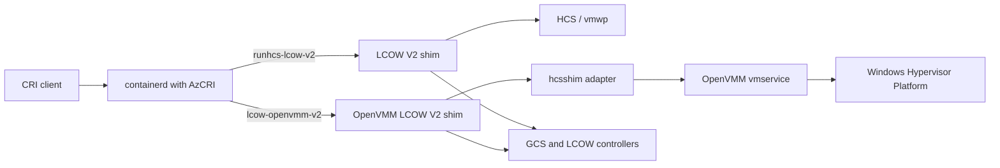

# OpenVMM-backed LCOW V2

This prototype runs the existing LCOW V2 shim and GCS control plane on OpenVMM/WHP instead of
HCS/vmwp. GCS-facing sandbox, container, process, OCI, and I/O contracts remain unchanged;
hcsshim adds the host-side VM, SCSI, networking, transport, and cleanup adapter.

OpenVMM is opt-in. The normal LCOW V2 runtime remains unchanged and never falls back from a selected
OpenVMM runtime to HCS.

## Architecture



| Handler | Runtime type | Executable | VM host |
|---|---|---|---|
| `runhcs-lcow-v2` | `io.containerd.lcow.v2` | `containerd-shim-lcow-v2.exe` | HCS |
| `lcow-openvmm-v2` | `io.containerd.lcow-openvmm.v2` | `containerd-shim-lcow-openvmm-v2.exe` | OpenVMM |

The normal shim is built with `lcow`. The opt-in binary is built with `lcow openvmm_prototype`.

## Repository contracts

### hcsshim

The hcsshim change provides the adapter while preserving the HCS path:

- Select HCS or OpenVMM at service composition through mutually exclusive build-tagged files.
- Build `vmservice.CreateVMRequest` directly from existing LCOW options and annotations; do not build
  or translate an HCS document on the OpenVMM path.
- Reject unsupported settings before launching OpenVMM.
- Adapt vmservice to the lifecycle operations already consumed by `vmmanager`.
- Use one backend-neutral guest transport factory: AF_HYPERV for HCS and AF_UNIX hybrid-vsock paths
  for OpenVMM.
- Own the OpenVMM child, vmservice connection, serial relay, DIO network bindings, and socket paths.
- Bound startup and cleanup, retain failed resources for retry, and prevent pathname replacement
  races with delete-denying handles.
- Return `ErrNotImplemented` for OpenVMM save and live migration while leaving HCS behavior intact.

Generated vmservice bindings are checked in under `internal/vmservice`. See
[`vmservice-bindings.md`](vmservice-bindings.md) for source and regeneration details.

### OpenVMM

Repository: <https://github.com/microsoft/openvmm>

Compatible OpenVMM implementation: [`3d740549ef67c4bb96212f8a2f209df272832777`](https://github.com/shreyanshjain7174/openvmm/commit/3d740549ef67c4bb96212f8a2f209df272832777).
It is based on upstream commit `61fd38fe6114d0955a082aa717a8e16e722b8490`.

The compatible `openvmm.exe` must include LCOW parity in its vmservice-created VM path:

- TimeSync integration for normal GCS boot.
- Four LCOW VMBus SCSI controllers, created when SCSI disks are present and indexed by
  `SCSIDisk.controller` for create, add, and remove.
- Dynamic VMBus device identity and removal for DIO NIC cleanup, using existing
  `NICConfig.nic_id`.
- Shutdown/KVP lifetime and teardown ordering when those integration components are enabled.

LCOW SCSI controller identities are fixed:

| Index | VMBus instance ID |
|---:|---|
| 0 | `df6d0690-79e5-55b6-a5ec-c1e2f77f580a` |
| 1 | `0110f83b-de10-5172-a266-78bca56bf50a` |
| 2 | `b5d2d8d4-3a75-51bf-945b-3444dc6b8579` |
| 3 | `305891a9-b251-5dfe-91a2-c25d9212275b` |

### containerd / AzCRI

The containerd/AzCRI change must:

- decode `io.containerd.lcow-openvmm.v2` with the existing `runhcsoptions.Options` schema;
- run reusable LCOW V2 tests through the selected handler;
- add OpenVMM lifecycle, image, network, and cleanup coverage.

Backend selection requires no new CRI field or annotation. Network acceptance must explicitly enable
and validate the existing CNI/HNS path; lifecycle-only tests may disable pod networking.

### ContainerPlatform packaging

A deployment must package compatible versions of:

- `containerd-shim-lcow-openvmm-v2.exe`;
- `openvmm.exe` with the OpenVMM requirements above;
- the LCOW kernel and `rootfs.vhd` used by the supported VHD-root boot path.

It must register `lcow-openvmm-v2` with runtime type `io.containerd.lcow-openvmm.v2`, sandboxer
`v2shim`, and snapshotter `windows-lcow` without modifying `runhcs-lcow-v2`. It must also generate
the configuration below and fail on partial OpenVMM packaging. OpenVMM is launched lazily by the
shim; no additional Windows service is needed.

## Configuration

`openvmm-backend.json` must be beside the tagged shim. This example uses the default installation
directory; packaging must derive these paths from its configured install directory:

```json
{
  "openvmmBinaryPath": "C:\\ContainerPlat\\openvmm.exe",
  "vmServiceSocket": "C:\\ContainerPlat\\ovm\\vmservice.sock",
  "hybridVsockBase": "C:\\ContainerPlat\\ovm\\hvsock",
  "serialSocket": "C:\\ContainerPlat\\ovm\\serial.sock"
}
```

All fields are required absolute paths. Unknown fields and trailing JSON are rejected.
`vmServiceSocket` cannot contain `,` or `=` because it is embedded in OpenVMM's `--rpc` argument.
AF_UNIX paths are limited to 107 UTF-8 bytes; `hybridVsockBase` must leave room for derived suffixes.

## Host, boot, and mounts

- Windows AMD64 with virtualization available and Windows Hypervisor Platform enabled.
- Windows build 26100 or newer, matching the LCOW V2 shim support floor.
- Boot files from `BootFilesRootPath` or the normal default boot-files location.
- Kernel named `vmlinux` (preferred) or `kernel`, plus VHD1 root named `rootfs.vhd`.

The adapter does not populate `VirtioFSConfig`. VirtioFS through this runtime is unimplemented, and
dynamic host-directory mounts remain unsupported because LCOW uses runtime Plan9 modification rather
than OpenVMM's create-time VirtioFS contract.

## Prototype scope

Supported and validated:

- AMD64 direct kernel boot with VHD1 root;
- pod sandbox and workload container lifecycle;
- multiple containers, logs, process I/O, synchronous exec, and nonzero exit propagation;
- interactive terminal I/O and dimensions;
- SCSI disk add/remove and DIO networking;
- targeted, retryable cleanup of processes, network resources, and socket paths.

Unsupported or unverified:

- ARM64, confidential VMs, WCOW on OpenVMM, VPMEM, and vPCI assignment;
- save, restore, and live migration;
- dynamic host-directory mounts and VirtioFS through CRI;
- broad statistics and resource-control enforcement;
- NUMA, CPU groups, resource partitions, storage QoS, and custom hvsock tables;
- concurrent sandboxes with one host-wide socket configuration and restart recovery;
- production signing, servicing, and rollout.

## Build and test

```powershell
# Existing HCS-backed shim
go build -tags lcow -o containerd-shim-lcow-v2.exe ./cmd/containerd-shim-lcow-v2

# Opt-in OpenVMM shim
go build -tags "lcow openvmm_prototype" `
  -o containerd-shim-lcow-openvmm-v2.exe `
  ./cmd/containerd-shim-lcow-v2

# At the compatible OpenVMM revision pinned above
cargo build --locked -p openvmm

# Focused adapter tests
go test -tags "lcow openvmm_prototype" `
  ./internal/controller/vm `
  ./internal/safefile `
  ./internal/vm/guestmanager `
  ./internal/vm/manager `
  ./internal/vm/transport `
  ./internal/vm/vmmanager `
  ./internal/vmservice `
  ./cmd/containerd-shim-lcow-v2 `
  ./cmd/containerd-shim-lcow-v2/service/...
```

Before release, run both HCS and OpenVMM handlers on the target Windows build, including network-on,
network-off, failed-create cleanup, targeted device removal, terminal I/O, and residue checks.

## Delivery order

The integration spans separately owned repositories:

1. OpenVMM: vmservice LCOW parity and DIO removal.
2. hcsshim: opt-in backend, lifecycle adapter, transport, and generated client.
3. containerd/AzCRI: runtime-option decoding and handler-driven CRI acceptance tests.
4. ContainerPlatform: configuration, signed artifacts, and deployment validation.
Each repository must preserve its existing default behavior until its dependencies are available.
